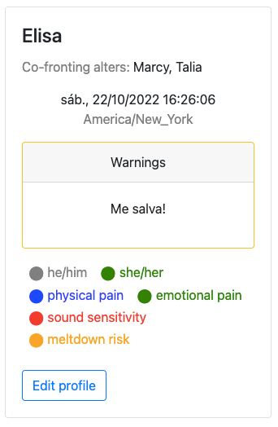

# jagl-shehacks-2022

Prototype developed during [SheHacks 2022](http://shehacks.xyz/).

Project idea: a mental health status page.

**DO NOT USE IN PRODUCTION!** I didn't implement any kind of access control or authentication. This was really just a hackathon demo.

## Frontend

Development tools/dependencies:

  * Node v18.9.0
  * Yarn 1.22.19

`cd jagl-pwa && yarn dev`

## Backend

Development tools/dependencies:

  * [Air](https://github.com/cosmtrek/air) v1.40
  * Go 1.19.1

`cd backend && make dev`
